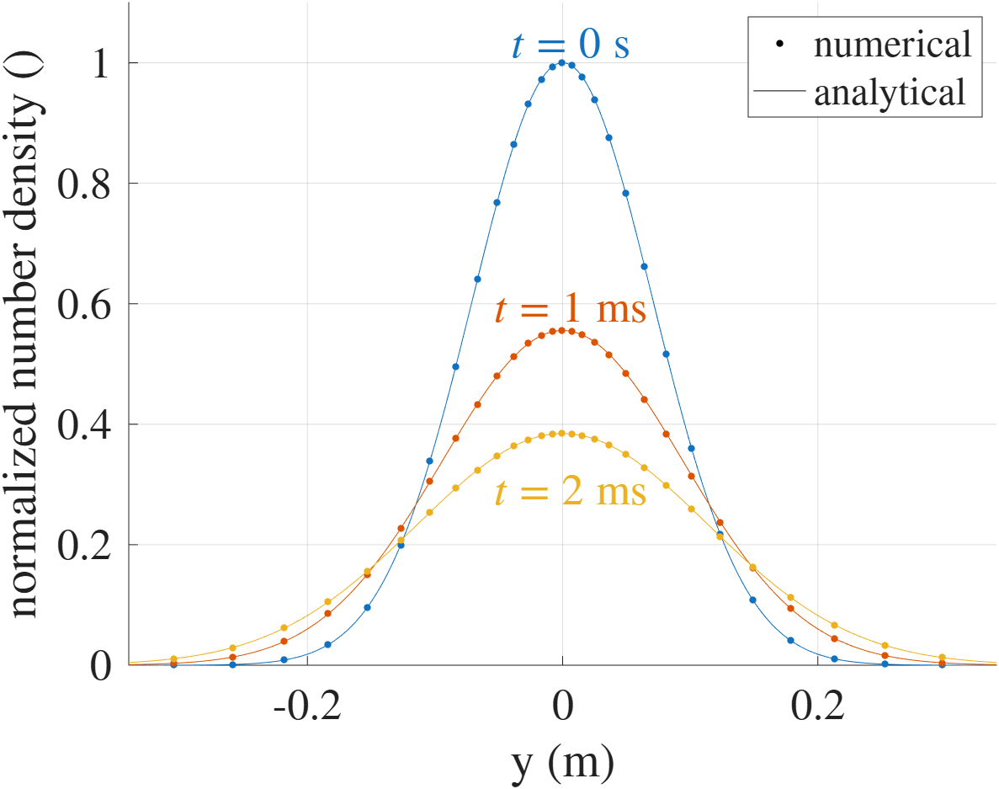
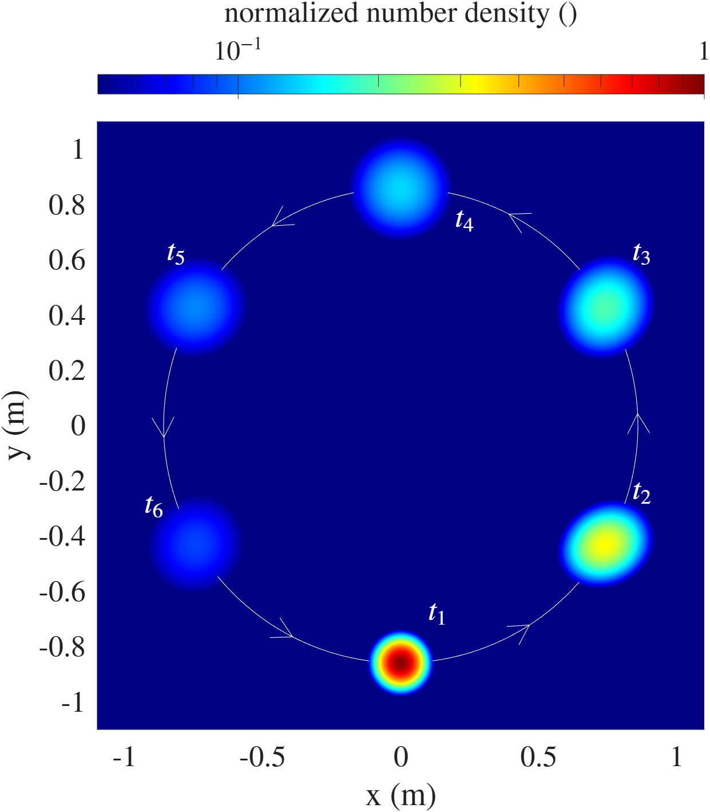
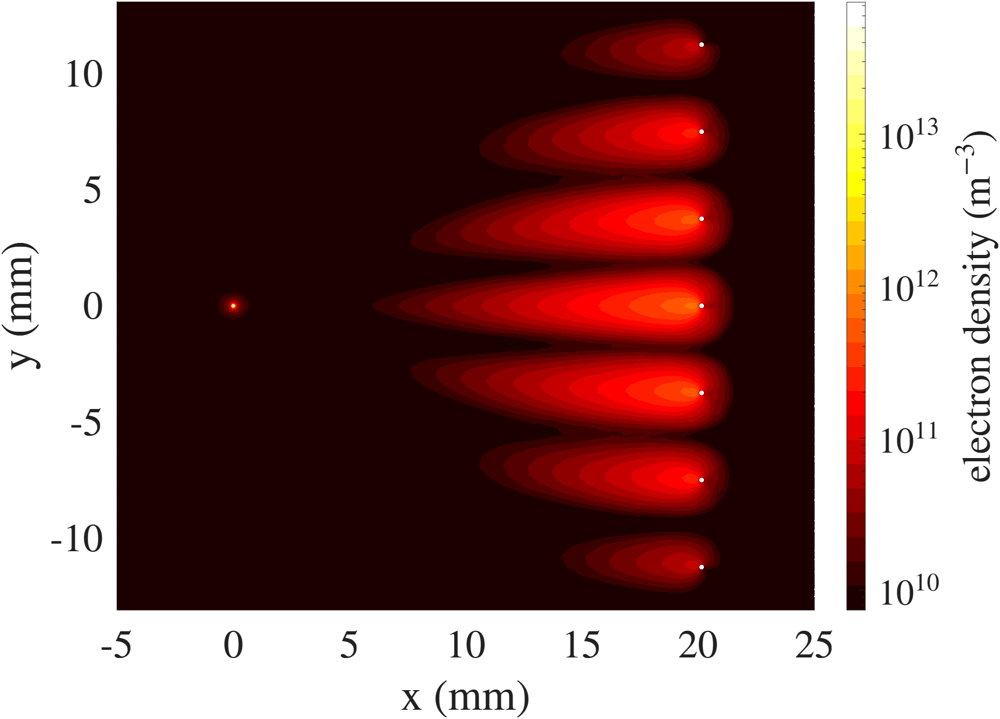
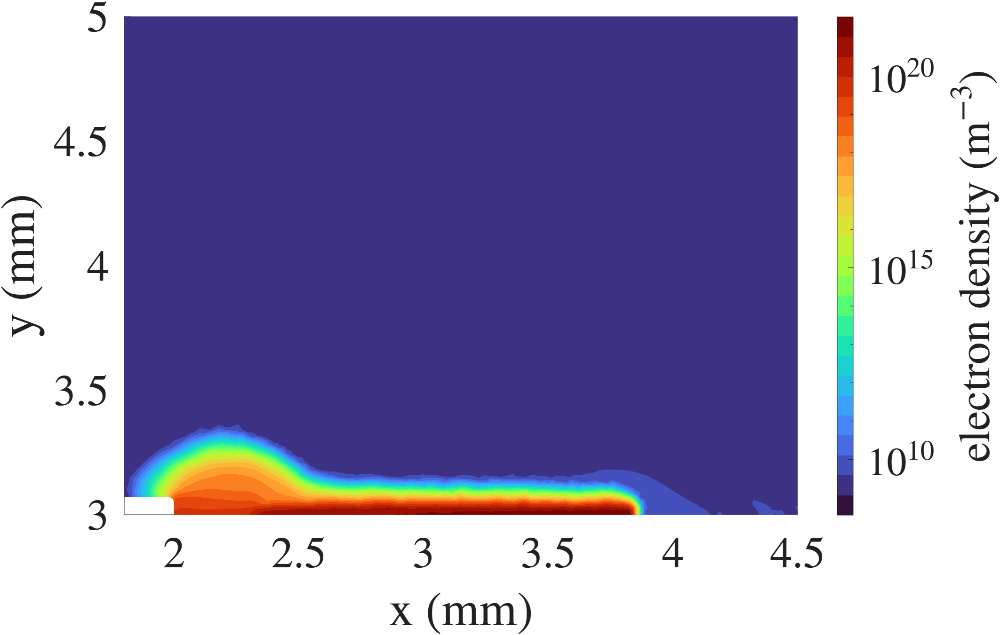
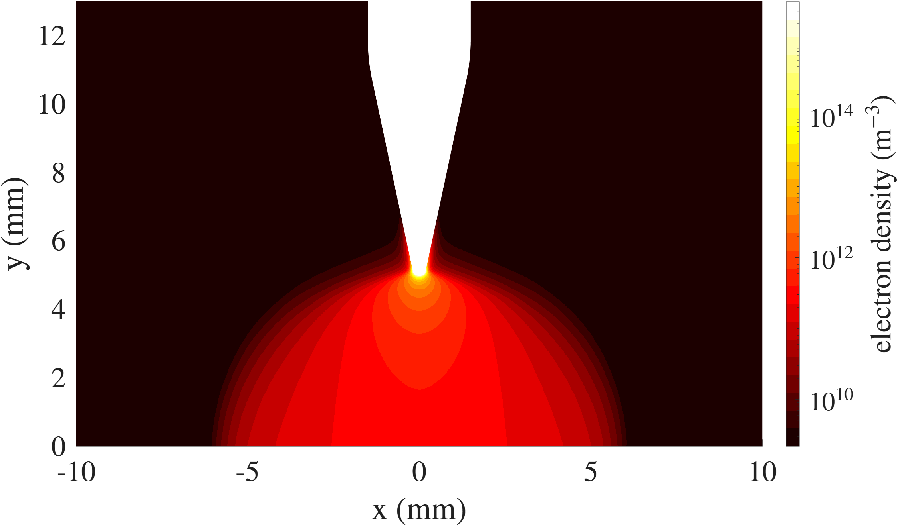

# Merlino2D


Merlino2D is an open-source plasma simulation code designed to provide a fast and user-friendly platform for modeling a broad range of plasma devices and gas discharges. The code is based on a drift–diffusion fluid framework and can accommodate detailed kinetic reaction schemes, depending on the chosen mesh resolution. Merlino2D employs a fully implicit time-integration scheme with adaptive time stepping, enabling stable and computationally efficient simulations. The code is implemented in MATLAB and supports two-dimensional plasma simulations on unstructured triangular meshes generated using Gmsh.

## Installation
To use Merlino2D you need MATLAB installed on your computer.
You also need to install [Gmsh](https://gmsh.info/) for mesh generation.

The first time using Merlino2D it is necessary to run the script **Merlino2D_startup.m**
that is inside the **src/** folder.
By running this script, you will be firstly asked to select the **gmsh.exe** executable, that you should have previously installed on your computer.
After, you will be asked to select the **Code/** folder of the [LoKI-B](https://github.com/LoKI-Suite/LoKI-B) repository, that you should have cloned on your device if you wish to have the option of using the Boltzmann solver for computing swarm parameters and rate coefficients.

If the folder containing the project is moved to another location, you need to run **Merlino2D_startup.m** again.


## Structure
The main folder contains the script **init.m**, that always needs to be run before using the code.

The main folder also contains 8 sub-folders:
- **cases/** contains the scripts for running some tests, with the aim of illustrating the capabilities of the code.
- **data/** contains the csv variables (described in chapter 6.11 of the user manual) created by the user. Some files of this type are already present inside this folder.
- **doc/** contains the user manual of the code. 
- **geo/** contains the **.geo** mesh files that are generated with the Gmsh program.
- **images/** contains some results pictures. 
- **kinetic/** contains the definition of the kinetic schemes. Some kinetic schemes have already been provided and can be used as reference for the creation of custom ones.
- **loki_inputs/** contains examples of input files for the LoKI-B Boltzmann solver.
- **src/** contains all the functions that compose **Merlino2D**, organized in sub-folders. It also contains the script **Merlino2D_startup.m**, that needs to be run only the first time the code is used.


## Tests

### 1) Diffusion


The **Diffusion_i.m** script corresponds to a simulation where a spatial Gaussian distribution of number density (with standard deviation $\sigma_x = 0.1 \, \mathrm{m}$, $\sigma_y = 0.1 \, \mathrm{m}$) is let free to evolve in time in a square domain. No external field is applied and zero-flux boundary conditions are applied at the boundaries. Running the script **Diffusion_run.m** will run the simulation and plot a 1D comparison of the results obtained with the analytical solution. 


### 2) Drift


The **Drift_i.m** script corresponds to a simulation where a spatial Gaussian distribution of number density is forced to rotate in the domain. To achieve that you need to uncomment 2 lines in the function **DaeFunc2DNoR.m**. Remember to comment them again once you are done with this test. Running the script **Drift_run.m** will run the simulation and plot the results at six different time instants.

### 3) Corona (wire - wire grid geometry)


The **CoronaWireWireGrid_i.m** script corresponds to a simulation of a corona discharge in a geometry consisting of a thin wire emitter ($r = 50 \mathrm{\mu m}$) and a grid of 7 wires as collectors ($r = 100 \mathrm{\mu m}$). Due to symmetry, only the top-half part of the domain is meshed. The discharge is in atmospheric pressure air, and the kinetic model from [Parent et al.](https://www.sciencedirect.com/science/article/pii/S0021999113007912?via%3Dihub) is used. A voltage ramp from $7 \mathrm{kV}$ to $20 \mathrm{kV}$ is applied at the emitter while the collectors are grounded. A ballast resistor of $1 \mathrm{k\Omega}$ is considered in the external circuit. The photoionization model from [Bourdon et al.](https://iopscience.iop.org/article/10.1088/0963-0252/16/3/026) is used. This simulation will use LoKI-B to compute the mobility and diffusion coefficient of electrons, and also the electron temperature as a function of the reduced electric field. Run the script **CoronaWireWireGrid_run.m** to run this simulation.

### 4) Surface DBD 


The **DBD_i.m** script corresponds to a simulation of a surface dielectric barrier discharge in air at atmospheric pressure in a geometry with an HV electrode of length $2 \mathrm{mm}$ and thickness $70 \mathrm{\mu m}$ on top of a dielectric layer ($\varepsilon_r = 3.2$) with thickness of $3 \mathrm{mm}$. The grounded electrode on the bottom part of the dielectric layer has a length of $5 \mathrm{mm}$. A sinusoidal voltage with amplitude $15 \mathrm{kV}$ and frequency $100 \mathrm{kHz}$ is applied at the HV electrode. The chemical model for air from [Morrow et al.](https://iopscience.iop.org/article/10.1088/0022-3727/30/4/017) is used. A ballast resistor of $100 \mathrm{\Omega}$ is considered in the external circuit. The secondary electron emission coefficient at the HV electrode is set to $0.05$, while it is $0.01$ at the dielectric interface. Run the script **DBD_run.m** to run this simulation.

### 5) Corona (point - plane geometry) 


The **PointPlane_i.m** script corresponds to a simulation of a corona discharge in atmospheric pressure air in a point-plane geometry. Cylindrical coordinates are used for this simulation. The needle point has a curvature radius of $200 \mathrm{\mu m}$ and its distance from the plane is $5 \mathrm{mm}$. The plane is grounded while the voltage applied to the needle goes from $4 \mathrm{kV}$ to $10 \mathrm{kV}$. The kinetic scheme employed is the one proposed in [Parent et al.](https://www.sciencedirect.com/science/article/pii/S0021999113007912?via%3Dihub). The secondary electron emission coefficient at the cathode is set to $0.01$. Run the script **PointPlane_run.m** to run this simulation.


## Workflow
Every time you open MATLAB, to use the code you have to run the script **init.m** 
that is inside the main folder. You can do it by selecting the file and pressing **F9**, or typing in the Command Window
```
init
```
This will add to the MATLAB path the folder **src/** that contains the code.


The core of the code is the function `Merlino2D`. After you have crated the input file for the simulation, for example **my_input.m**, you can run it with the command
```
out = Merlino2D("my_input","run");
```
`out` is the output structure that will contain all the relevant results from the simulation.
You can visualize the 2D domain results with the command `Mview(out,'x')`. To visualize the voltage and current results use `Mview(out,'i')` and to visualize the results relative to the surface charge (where appropriate) use `Mview(out,'s')`. You can also combine together the visualizations, for example using 
```
Mview(out,'xi')
```
To save the results of a simulation (contained in the `out` structure) inside the folder **my_results/**, use the `Save` function.
```
Save(out,"my_result");
```
To retrieve the results of a simulation that was previously saved, use the `Load` function.
```
out = Load("my_result");
```